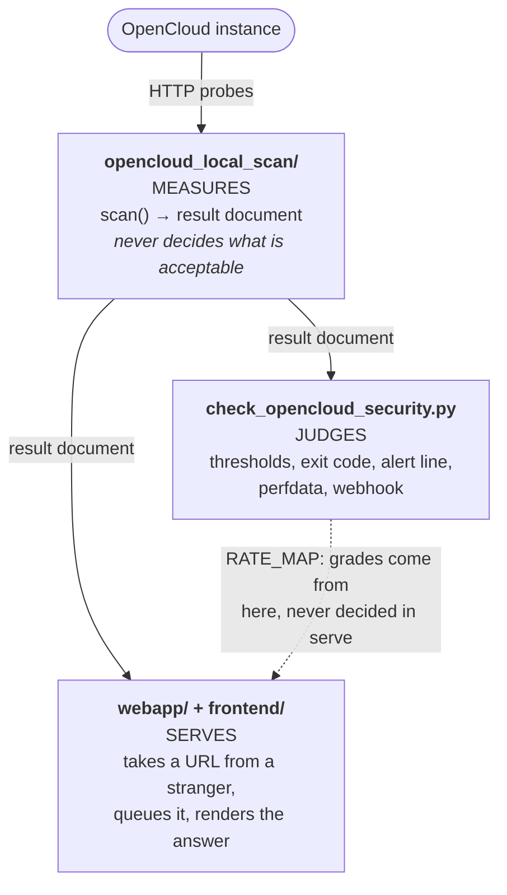
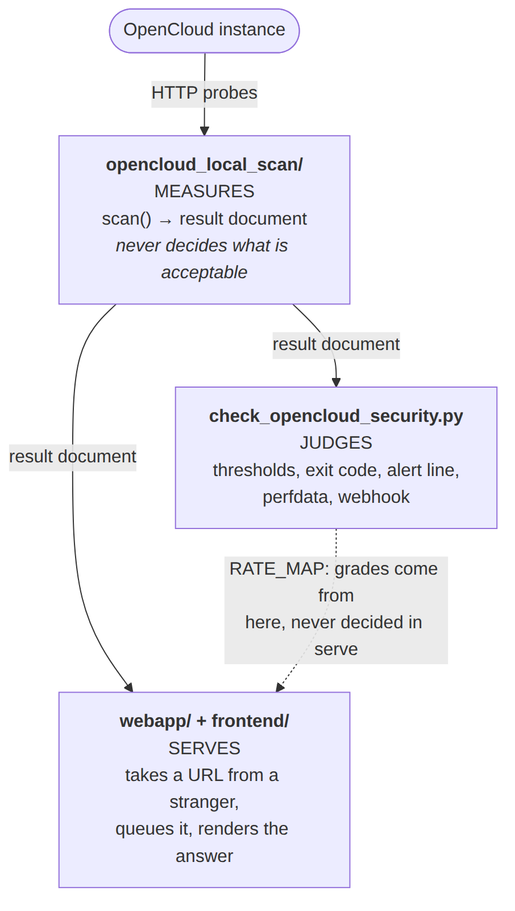

# Architektur

So ist das Repository aufgebaut, und deshalb verlaufen seine Grenzen genau hier. Die Regeln stehen in [`AGENTS.md`](../../../AGENTS.md); die Entscheidungen und verworfenen Alternativen findest du unter [`adr/`](../../../adr/README.md).

## In einem Satz {#the-one-sentence-version}

Ein Monitoring-Plugin fragt eine OpenCloud-Instanz selbst ab, ermittelt daraus eine Bewertung von `0` bis `5` und beendet sich mit einem Nagios-Status. Dazu kommen die zugrunde liegende Bibliothek und ein Webdienst, der dieselbe Bibliothek ohne lokale Installation nutzbar macht.

Es gibt keine externe Scan-API. Kein anderer Dienst liefert ein Urteil. Die Skala `0`–`5` entspricht nur deshalb der Nextcloud-Scan-API, damit bestehende Schwellenwerte, Diagramme und Alarmregeln ihre Bedeutung behalten.

## Drei Schichten {#three-layers}

Die Grenzen sind Teil des Entwurfs. Eine Änderung, die sie verwischt, gehört in eine andere Datei.





### Messen: `opencloud_local_scan/` {#measure-opencloud_local_scan}

Die Scanner-Bibliothek: `scan()` prüft eine Instanz über HTTP und liefert ein Ergebnisdokument. Sie kennt weder WARNING noch CRITICAL.

| Modul | Aufgabe |
|:--|:--|
| `scanner.py` | Scan-Ablauf, Befunde, Ausnahmen und Bewertung |
| `versions.py` | Lebenszyklus: Kanäle, Versionslinien, Supportende |
| `releases.py` | Aktualisierungsprüfung mit kanalbezogener Empfehlung |
| `hardening.py` | Erläuterungen zu allen Härtungskennungen |
| `tls.py` | Transportsicherheit: Protokoll, Zertifikat, Kette, Stapling |
| `remediation.py` | Nach den Bewertungsgrenzen geordnete Maßnahmen |
| `config.py`, `factory.py` | Konfiguration, Geheimnisse, Aufbau der Einstellungen |
| `wizard.py`, `selfupdate.py` | `--configure` und `--upgrade-self` |
| `data/release_schedule.json` | Mitgelieferter Release-Zeitplan |

Ergebnisschlüssel verwenden camelCase: `extraChecks`, `ratingExplanation`, `latestVersionInBranch`; `EOL` bleibt großgeschrieben.

### Bewerten: `check_opencloud_security.py` {#judge-check_opencloud_securitypy}

Das Plugin verantwortet Schwellenwerte, Exit-Code, Alarmzeile, Perfdata und Webhook. Seine Ausgabe verwendet snake_case: `failed_extra_checks`, `plugin_version`, `rating_label`.

Die Startreihenfolge ist verbindlich: `_run_early_commands()` → `_preparse_config()` → `_set_configuration()` → `build_arg_parser()` → `parse_args()`. Ohne Vorgabe aus der Umgebung ist `--host` Pflicht. Modi ohne Scan müssen deshalb schon in `_run_early_commands()` abgefangen werden, bevor der Parser einen Host verlangt.

### Bereitstellen: `webapp/` und `frontend/` {#serve-webapp-and-frontend}

Der öffentliche Dienst nimmt eine URL entgegen, übergibt sie dem Scanner und zeigt das Ergebnis. Er implementiert keine Prüfung neu und entscheidet keine Note: `catalog.summarise()` gruppiert das vorhandene Ergebnisdokument; die Buchstaben kommen aus `RATE_MAP` des Plugins.

| Modul | Aufgabe |
|:--|:--|
| `app.py` | Routen, Sicherheitsheader, Anfragevalidierung |
| `settings.py` | Alle `COS_WEB_*`-Variablen, beim Start eingelesen |
| `ssrf.py` | Zulässige Verbindungsziele, zweifach geprüft |
| `ratelimit.py` | Client-Limit und Wartezeit je Ziel |
| `audit.py` | Optionale pseudonymisierte Audit-Spur |
| `store.py` | Ein Redis-Namensraum je Scan, TTL für jeden Schlüssel |
| `queue.py`, `tasks.py` | Übergabe an den ARQ-Worker und Ausführung |
| `runner.py` | Übersetzung einer Anfrage in `ScannerSettings` |
| `catalog.py` | Zulässige Ausnahmen und Dashboard-Gruppierung |
| `documentation.py`, `search.py` | Manifeste für öffentliche Anleitungen und die Suche |
| `i18n.py`, `locales/` | Sprachauswahl je Anfrage und vier Textkataloge |
| `reports.py` | CSV, SARIF und selbst erzeugtes PDF |
| `redis_backend.py` | Redis-Client und Ersatz im Testprozess |
| `workflows.py` | Aufgaben: absenden, abfragen, warten, abschließen, exportieren |
| `openapi.py` | Explizit geschriebenes OpenAPI-3.1-Dokument |
| `arazzo.py` | Beschreibung der Abläufe in Arazzo 1.0.1 |
| `mcp_server.py` | MCP-Endpunkt: dieselben Aufgaben für einen Agenten |
| `prompts.py` | Einmal definierte Vorlagen für typische Aufgaben |
| `mcp_auth.py` | Optionale Anmeldung an `/mcp`: Tokens prüfen, niemals ausstellen |
| `discovery.py` | `/.well-known/ai.json` mit Verweisen auf diese Schnittstellen |
| `seo.py` | Kanonische URLs, `robots.txt`, generierte Sitemap |
| `purge.py` | Löschung auf Anfrage mit Nachweis |
| `encryption.py` | Optionale AES-256-GCM-Verschlüsselung gespeicherter Ergebnisse |

Die Selbstbeschreibung und Agentensteuerung über `/openapi.json`, `/arazzo.json`, `/mcp` und `/.well-known/ai.json` bleiben Teil dieser Schicht; siehe [Agentenschnittstellen](#the-agent-facing-surfaces).

`frontend/` enthält Vorlagen und Assets, keine Fachlogik; `webapp/` enthält kein Markup. Browserressourcen kommen ausschließlich aus `/static`. Die CSP erlaubt kein `unsafe-inline`: keine eingebetteten Stile, Skripte oder Ereignisbehandler.

### Lokalisierung des Frontends {#frontend-localization}

Ein Vorlagensatz unterstützt Englisch, Deutsch, Spanisch und Französisch. Englisch ist der Quellkatalog; die Übersetzungen behalten Schlüssel, Platzhalter und Inline-Markup bei. `app.py` bindet einen Übersetzer an jede HTML-Anfrage:

```text
validated cos_locale cookie
          │
          ├── absent ──► weighted Accept-Language
          │
          └── unsupported/absent ──► English
                                      │
                                      ▼
                         shared Jinja templates + <html lang>
```

`POST /language` setzt ein Cookie mit `HttpOnly` und `SameSite=Lax` und leitet nur auf einen geprüften lokalen Pfad weiter. Seiten variieren nach `Cookie` und `Accept-Language`. URLs enthalten keine Sprache; eine Ergebnis-UUID bleibt eine Zugriffsberechtigung unter einer Adresse.

Übersetzt wird nur das anwendungseigene HTML. OpenAPI, Arazzo, MCP, Discovery-Dokumente und Exporte bleiben englische Verträge. Gemessene Werte und Fehlermeldungen fremder Instanzen bleiben unverändert. JavaScript erhält Texte über übersetzte `data-*`-Attribute, nicht über einen zweiten Katalog. Anleitungen werden aus englischen, deutschen, französischen und spanischen Quellen generiert (`GUIDE_LANGUAGES`, ADR 0058, 0062, 0063). Eine Sprache ohne Quelle erhielte den englischen Inhalt mit `lang="en"` und einem übersetzten Hinweis.

`scripts/build_search_index.py` erzeugt beim Release einen englischen Suchindex und deutsche, spanische und französische Ergänzungen. Das öffentliche Manifest ist die einzige Quelle: Übersetzungen schaffen keinen Weg von Scan-Ergebnissen in die Suche. ADR 0020 beschreibt die Sprachwahl, ADR 0019 die Suchgrenze.

## So erreichen Einstellungen den Scanner {#how-settings-reach-the-scanner}

Eine Richtung, vier Quellen, eine Rangfolge:

```text
YAML/JSON file ─┐
environment  ───┼─→ config.Configuration ─→ factory.py ─→ frozen *Settings ─→ scanner
CLI flags    ───┘        (flat COS_ names)     (builds)       (dataclasses)
```

- `config.py` flacht verschachtelte Schlüssel ab: `scanner.target_port` wird zu `SCANNER_TARGET_PORT`, als Umgebungsvariable `COS_SCANNER_TARGET_PORT`. Listen werden mit `;` verbunden.
- Rangfolge: **CLI-Flag > Umgebungsvariable > Datei > Standardwert**. Beide CLIs übergeben für nicht gesetzte Werte `None` an `factory.py`.
- Nur `factory.py` erzeugt die unveränderlichen `ScannerSettings` und `ReleaseSettings`.
- `.json` wird als JSON gelesen, alles andere als YAML. Die Endung entscheidet, nicht der Inhalt.

Die Webanwendung nutzt diese Kette nicht. Ihre `COS_WEB_*`-Umgebungsvariablen werden einmal beim Start gelesen: Eine Anfrage darf das Ziel wählen, niemals die Last.

## So durchläuft ein Scan die Webanwendung {#how-a-scan-flows-through-the-web-application}

```text
POST /api/scans ──► client rate limit ──► SSRF guard ──► waiver allow-list
POST /api/scans/batch  (per target, in order)                 │
                                                              ▼
                                                       target cooldown
                                                              │
                                                    uuid + Redis namespace
                                                              │
                                                          ARQ queue
                                                              │
                                                     worker: validate the
                                                     target again, scan,
                                                     store the result
                                                              │
                          GET /scan/{uuid} ◄───────────────────┤
                          GET /api/scans/{uuid}                │
                          GET /api/scans/{uuid}/export/{fmt} ◄─┘
```

Das Client-Limit kommt zuerst: Ein einzelnes Redis-`INCR` schützt den Resolver hinter der SSRF-Prüfung vor Verstärkungsangriffen. Die Zielwartezeit wird mit `SET NX` beansprucht, sodass zwei gleichzeitige Anfragen für dieselbe Instanz nicht beide starten. Erst danach entsteht eine UUID.

Eine Sammelanfrage durchläuft dieselbe Pipeline für jedes Ziel in Eingabereihenfolge. Kein Ziel umgeht ein Limit; die Antwort zeigt, welche Scans gestartet wurden und welche nicht.

Bei Überlast wird eingereiht: Zusätzliche gültige Anfragen erhalten eine UUID und warten in FIFO-Reihenfolge mit sichtbarer Warteschlangenposition. Eine gültige Anfrage erhält nie 503.

## Agentenschnittstellen {#the-agent-facing-surfaces}

Ein KI-Agent muss allein aus der Dienstadresse erkennen können, was der Dienst bietet, und ihn nutzen können, ohne Repository oder `AGENTS.md`. Vier Bausteine ermöglichen das; **keiner enthält eigene Prüfungen, Limits oder Bewertungen.**

### Eine Ablaufebene, drei Beschreibungen {#one-workflow-layer-three-descriptions}

```text
                    webapp/workflows.py
             the semantics: submit -> poll -> wait ->
             complete -> export, and the rules for each
                            |
        +-------------------+-------------------+
        v                   v                   v
   openapi.py           arazzo.py          mcp_server.py
   what operations      how they combine   an agent performs
   exist                into a task        the task
        |                   |                   |
   /openapi.json       /arazzo.json           /mcp
```

`workflows.py` definiert Zahlen und Entscheidungen einmal: `202` für angenommene Anfragen, Abfrageintervall, Versuchslimit, endgültiges `404` bei unbekannter UUID und `409` beim Export für „noch nicht“. Arazzo liest diese Konstanten, MCP ruft diese Funktionen auf; Tests verhindern abweichende Zahlen. Widerspricht eine Beschreibung der API, ist die Beschreibung fehlerhaft.

`mcp_server.py` ruft **die eigene HTTP-API innerhalb desselben Prozesses** über den normalen ASGI-Stack auf. SSRF-Schutz, Client-Limit, Zielwartezeit, Warteschlange und Löschberechtigung gelten dadurch unverändert. Ein Agent erhält weder einen zusätzlichen Ausführungspfad noch höhere Limits als ein Browser. Siehe [ADR 0011](../../../adr/0011-mcp-is-an-execution-layer-not-a-second-implementation.md).

Sechs Werkzeuge bilden **Aufgaben statt Endpunkte** ab: `scan_instance`, `scan_instances`, `get_scan_result`, `plan_remediation`, `export_scan`, `erase_instance_data`. Ein Scan benötigt einen Werkzeugaufruf; `workflows.py` übernimmt die Abfragen. Fünf Ressourcen unter `spec://check-opencloud-security/...` bieten Referenzmaterial innerhalb des Protokolls:

- `openapi`, `arazzo`, `discovery`: die Verträge.
- `catalogue`, `advisories`: die **Wissensbasis** mit Härtungskennungen, Zusatzprüfungen und vollständiger Advisory-Datenbank. Sie verwenden direkt `webapp/catalog.py` und `webapp/advisories.py`, wie die Seite `/catalogue`. Ein Agent kann Befunde erklären und die Prüfungen kennenlernen, ohne ein Ziel einzureichen oder abweichende Erläuterungen zu erhalten.

Sechs **Prompts** benennen typische Aufgaben: `audit_instance`, `audit_estate`, `explain_scan_result`, `triage_findings`, `review_transport_security`, `check_release_support`. Ihr Text steht einmal in `prompts.py`, zusammengesetzt aus Hinweisen und Konstanten in `workflows.py`. Sie nennen Werkzeuge statt Endpunkte, weil diese die Limits durchsetzen. Siehe [ADR 0014](../../../adr/0014-prompts-are-tasks-and-their-text-lives-beside-the-workflows.md).

Standardmäßig ist der Endpunkt **ohne Anmeldung erreichbar**. Für eine interne Bereitstellung aktivierst du `COS_WEB_MCP_AUTH_ENABLED` und konfigurierst einen Aussteller. `mcp_auth.py` prüft als OAuth-2.0-Ressourcenserver Bearer-Tokens offline anhand veröffentlichter Schlüssel: Signatur, Aussteller, Zielgruppe, Ablauf und Berechtigungen; nur asymmetrische Algorithmen. Eine `401`-Antwort verweist auf das RFC-9728-Metadatendokument und damit den Anbieter. Der Dienst stellt nichts aus, speichert nichts und führt keine Konten. `docker/docker-compose.authentik.yml` bietet einen vollständigen alternativen Stack mit Identitätsanbieter; der Anwendungscode kennt dessen Namen nicht.

**Authentifizierung entscheidet über den Zugang, nicht über die Last.** Alle Limits und Prüfungen gelten auch nach der Anmeldung. **Eine konfigurierte, aber nicht durchsetzbare Anmeldung verhindert den Start**, ebenso wie Verschlüsselung ohne Schlüssel. Ein vermeintlich geschützter, tatsächlich offener Endpunkt wäre das schlechteste Ergebnis. Siehe [ADR 0015](../../../adr/0015-the-mcp-endpoint-may-require-a-sign-in.md).

### WebMCP im Browser {#browser-webmcp}

Bei aktiviertem MCP stellen Start- und Ergebnisseite ihre aktuellen Aktionen über den [WebMCP-Entwurf](https://webmachinelearning.github.io/webmcp/) bereit. Das ist ein clientseitiger Adapter:

```text
Jinja context -> _webmcp.html -> /static/js/webmcp.js
                                      |
                                      v
                         fetch with Accept: application/json
                                      |
                    +-----------------+------------------+
                    v                 v                  v
             POST /api/scans   GET /api/scans/{uuid}   export route
```

Jinja erzeugt JSON-Schemas aus den Optionen der gerenderten Seite. Kanäle, Ausgabeformate, Ausnahmekennungen und Exportformate stammen daher nicht aus einem zweiten Browserkatalog. Auch wiederholbare Statuscodes und Wartezeiten kommen aus `webapp/workflows.py`. Das externe Skript registriert Werkzeuge nach `DOMContentLoaded` und prüft zuvor die WebMCP-Verfügbarkeit. Es unterstützt das frühere `navigator.modelContext` und das aktuelle `document.modelContext` und bevorzugt deklaratives `provideContext`, falls verfügbar.

Fehler werden als `ok: false` mit `status`, `error`, `retryable`, `retryAfter` zurückgegeben, nicht geworfen. Das entspricht dem bestehenden `/mcp`-Vertrag ([ADR 0041](../../../adr/0041-a-browser-tool-answers-a-failure-rather-than-throwing.md)).

Die Startseite bietet `scan_opencloud_security`; die Ergebnisseite bietet `get_scan_result` und `export_scan_report`, gebunden an ihre UUID. Andere Seiten registrieren nichts. Jede Aktion nutzt die normale HTTP-API mit `Accept: application/json`; Schutzmechanismen und Berechtigungsprüfungen bleiben einmal implementiert. `COS_WEB_ENABLE_MCP=false` entfernt sowohl Browserregistrierungen als auch `/mcp`. ADR 0021 beschreibt diese Grenze.

### Auffindbarkeit {#discovery}

Ein Dateiname allein macht keine Schnittstelle auffindbar. Deshalb benennt ein Dokument alle Schnittstellen:

```text
https://scan.okxo.de
        |
        +--> /llms.txt             short agent-readable map
        +--> /agents.txt           capability declaration (agents-txt.com)
        |
        v
/.well-known/ai.json --+--> /openapi.json   operations
                       +--> /arazzo.json    workflows
                       +--> /mcp            server-side tools + knowledge base
                       +--> /ai             the same thing, for a human
```

`/llms.txt` ist der kurze Einstieg für Clients, die danach suchen, mit Verträgen und Nutzungsregeln ohne Ergebnisse, UUIDs oder Zugangsdaten. `/agents.txt` deklariert dieselben Fähigkeiten im [agents-txt.com](https://agents-txt.com)-Format: `Key: value` für `MCP`, `WebMCP` und nur bei tokenpflichtigem Endpunkt `Authorization`/`Identity`. Freigabe- und Sperrlisten bleiben Aufgabe von `/robots.txt`.

Diese Discovery-Konventionen sind keine registrierten Standards. `/.well-known/ai.json` ist das detaillierte Discovery-Dokument **dieser Anwendung**. Es liegt dort, wo Clients suchen, und enthält nur Namen, Beschreibung und absolute URLs. `base.html` ergänzt `service-desc`- und `arazzo`-Linkrelationen. `/ai` erklärt dieselben Informationen mit anklickbaren Links für Menschen und HTML-Crawler.

Alle Beschreibungen sind ohne Anmeldung unter stabilen Pfaden öffentlich. `COS_WEB_ENABLE_DOCS` steuert nur `/docs` und `/redoc`, niemals die JSON-Dokumente ([ADR 0010](../../../adr/0010-machine-readable-descriptions-are-always-public.md)). `COS_WEB_ENABLE_MCP` kann den MCP-Endpunkt abschalten; Discovery bewirbt ihn dann nicht mehr.

### Was MCP nicht tun darf {#what-mcp-may-not-do}

Der Endpunkt ist ein Zugang und wird entsprechend behandelt.

- **Keine zweite Implementierung:** Prüfungen, gelockerte Limits oder eigene Noten gehören nicht in `mcp_server.py`.
- **Kein Umgehen von Limits:** Jeder Aufruf zählt gegen seine tatsächliche Herkunftsadresse. Der Loopback-Standard des Transports würde sonst alle Agenten zusammenfassen. `COS_WEB_MCP_MAX_CONCURRENT_WAITS` begrenzt wartende Aufrufe. Am Limit wird der Scan trotzdem eingereicht; die UUID kommt mit einem Hinweis zum Abfragen zurück.
- **Kein Befehlskanal vom Ziel zum Modell:** Fremde Versionsangaben, Produktnamen und Fehlertexte werden normalisiert, bereinigt und gekürzt. Ein `untrusted`-Block benennt sie als zu berichtende, niemals zu befolgende Daten.
- **Keine Zugangsdatenhaltung:** `erase_instance_data` ist als destruktiv markiert und benötigt dieselbe Berechtigung wie die API. MCP liefert, protokolliert oder wiederholt diese Zugangsdaten nicht.
- **UUIDs werden vor dem Einbau in Pfade validiert:** Ein HTTP-Client löst `..` auf; `../../healthz` ist kein Scan.

## Parallelität {#concurrency}

Je Aufrufstelle, niemals verschachtelt.

- `_run_all(settings, tasks)` erzeugt einen eigenen `ThreadPoolExecutor`; `pool.map` erhält die durch Tests abgesicherte Eingabereihenfolge.
- Gruppenparallelität in `_collect_extra_findings` ist bewusst ausgeschlossen, weil sie die Workerzahl vervielfachen würde.
- Standardwert `1` bedeutet vollständig sequenzielle Ausführung.
- `requests.Session` ist nicht threadsicher. `_Probe` hält deshalb je Worker eine `threading.local`-Session und eine `_owner`-Threadkennung. Verwende für eine zweite Basis-URL `_Probe.derive(url)`; teile Sessions nie von Hand.
- Im Webdienst bestimmen `COS_WEB_MAX_WORKERS` gleichzeitige Scans und `COS_WEB_SCAN_CONCURRENCY` die Prüfungen innerhalb eines Scans. Anfragen können beides nicht ändern.

## Zustand und Lebensdauer {#state-and-its-lifetime}

Das Plugin hält keinen Zustand; die Webanwendung hält möglichst wenig:

- Drei Redis-Schlüssel je Scan (`scan:{uuid}:status|result|metadata`), jeweils mit TTL, plus eine gemeinsame Liste wartender UUIDs für die Warteschlangenposition.
- **Die UUID ist eine Zugriffsberechtigung.** Es gibt weder Auflistungsendpunkt noch erratbare Kennung noch Zugriff eines Scans auf fremde Schlüssel. Unbekannt, ungültig und abgelaufen liefern dasselbe 404.
- Logs enthalten Lebenszyklusmarkierungen und UUIDs. Die standardmäßig ausgeschaltete Audit-Spur in `audit.py` ist die Ausnahme und speichert Fingerabdrücke statt Adressen ([ADR 0004](../../../adr/0004-webapp-audit-logging.md)).
- Ergebnisse werden nicht gecacht ([ADR 0002](../../../adr/0002-no-scan-result-caching.md)); ein Worker-Heartbeat bestimmt die Bereitschaft, keine Prozessprüfung ([ADR 0003](../../../adr/0003-worker-health-heartbeat.md)).
- Alles läuft automatisch ab. `DELETE /api/purge` löscht auf Anfrage früher. Es gibt keine Zuordnung von Zielen zu Scans; die Löschung durchläuft deshalb den Schlüsselraum. Ein zweiter Durchlauf liefert den Zähler `remaining` für den Nachweis ([ADR 0007](../../../adr/0007-erasure-on-request.md)).
- `COS_WEB_ENCRYPT_RESULTS` verschlüsselt Ergebnisse mit AES-256-GCM. Ohne brauchbaren Schlüssel verweigert ein entsprechend konfigurierter Prozess den Start, statt unbemerkt Klartext zu schreiben ([ADR 0008](../../../adr/0008-refuse-to-start-without-the-encryption-key.md)).

## Bewertung {#the-rating}

Ausgangspunkt sind Version und Advisory-Datenbank. Fehlgeschlagene Prüfungen begrenzen die Bewertung (`SEVERITY_RATING_CAP`: kritisch 2, hoch 3, mittel 4, niedrig 5). Zwei getestete Invarianten gelten:

- **Die Erklärung ist unabhängig von der Iterationsreihenfolge.** Eine Grenze gilt als angewendet, wenn sie der Endbewertung entspricht.
- **Das Supportende hat immer Vorrang**, auch vor einer pauschalen Ausnahme. Ohne Sicherheitsupdates ist die Note F.

`remediation.py` berechnet, welche Behebung was verbessert, indem jeweils ein Befund aus derselben Berechnung entfernt wird. Der Plan wird aus dem Ergebnis abgeleitet, nirgends zusätzlich gespeichert und enthält nur Zahlen. Buchstaben ergänzt weiterhin die bewertende Schicht ([ADR 0012](../../../adr/0012-the-remediation-plan-is-derived-not-stored.md)).

Eine Ausnahme unterdrückt den Alarm, nicht die Belege. Der Befund bleibt mit `"ignored": true` im Ergebnis. Nur tatsächlich fehlgeschlagene Prüfungen lassen sich ausnehmen, damit eine spätere Verschlechterung nicht unbemerkt bleibt.

Fest in OpenCloud codierte, nicht behebbare Befunde tragen in `hardening.py` `actionable=False`: im Ergebnis sichtbar, aber ohne Alarmzeile, `hardenings_missing`-Metrik oder Webhook.

## Release-Lebenszyklus {#the-release-lifecycle}

OpenCloud veröffentlicht parallel Rolling (etwa alle drei Wochen), Production (etwa alle sechs Monate) und LTS (zwei Jahre). Releases bilden **Versionslinien** (`MAJOR.MINOR`); eine Linie kann mehreren Kanälen angehören.

- Rolling und Production enden beim nächsten Release desselben Kanals; LTS endet nach Zeitplan.
- **Eine neuere Version kann weniger unterstützt sein als eine ältere.** Das gehört zum Modell.
- **Dem Kanal voraus heißt nicht Supportende.** Nur eine Version hinter dem aktuellen Stand des gewählten Kanals ist nicht unterstützt.
- Empfehlungen zeigen ausschließlich vorwärts und wechseln Production oder LTS niemals zu Rolling.

`scripts/update_release_schedule.py` erzeugt `opencloud_local_scan/data/release_schedule.json` und den Block zwischen den `release-schedule`-Markierungen in `README.md`. Beide werden gemeinsam committed und nie von Hand bearbeitet.

### Eine neue OpenCloud-Version aufnehmen {#updating-for-a-new-opencloud-release}

Release-Fakten werden automatisch eingelesen; Kompatibilität erfordert immer Prüfung. Für jeden Kanal gilt:

1. **Mit Belegen beginnen.** `release-schedule.yml` oder `uv run python scripts/update_release_schedule.py` liest die maßgebliche Lebenszyklusseite. Der Workflow öffnet einen PR nur mit Zeitplan und generierter README-Tabelle. Beides nicht von Hand ändern; Kanäle nicht aus Versionsnummern ableiten.
2. **Den Kanal prüfen.** Bei Rolling und Production beendet der Nachfolger die Vorgängerlinie. Prüfe bei LTS Startdatum und zweijähriges Supportfenster. Neue Patches dürfen bekannte Kanäle oder Startdaten nicht entfernen. Ein abgelehntes Laufzeitupdate ist ein Warnsignal, kein Anlass, Regeln zu lockern.
3. **Das Herstellerimage getrennt testen.** Starte den Workflow `real OpenCloud container` mit unveränderlichem Digest in `candidate_image`. Er initialisiert das Image und prüft dessen öffentlichen Statusendpunkt. Halte die Version fest und untersuche Fehler bei Versionserkennung, TLS, Headern, Authentifizierungsumleitungen, offenen Endpunkten, Härtungsbelegen und Bewertung.
4. **Verändertes Verhalten zuordnen.** Vergleiche mit `tests/fake_opencloud.py`, `tests/test_local_scanner.py` sowie TLS- und Härtungstests. Ändere Fixtures oder Erwartungen nur mit Release-Belegen für altes und neues Verhalten, betroffene Version und Scannerregel. Keine Assertion entfernen, Note abschwächen oder Toleranz erweitern, nur damit der Kandidat besteht.
5. **Nur beobachtbare, behebbare Prüfungen ergänzen.** Messungen gehören in `opencloud_local_scan/`, Bewertungsentscheidungen ins Plugin. Bestätige im OpenCloud-Quellcode die Änderbarkeit einer Härtungseinstellung. Ergänze positive und negative Tests sowie Betreiber- und maschinenlesbare Dokumentation; ein ADR nur bei dauerhafter Grenzänderung.
6. **Advisory-Belege prüfen.** Starte `vulnerability-db.yml` oder warte auf den Lauf. Der PR darf betroffene Bereiche ergänzen, aber keine Advisories oder bekannten Bereiche entfernen. Prüfe neue Bereiche vor dem Merge anhand der Quelle.
7. **Bewusst übernehmen.** Nach Prüfung von Lebenszyklus, Advisories, Scanner und Tests aktualisierst du den geprüften Digest im Integrationsworkflow per PR. Führe `uv run pytest`, `uvx ruff check .`, `uv run mypy --config-file mypy.ini`, die Dokumentprüfung und den Container-Kandidatentest aus. Der Diff dokumentiert die Kompatibilität; keine direkten Änderungen von Release-Daten, Fixtures oder Versionsnummern in Produktion.

## Was wohin ausgeliefert wird {#what-ships-where}

| Artefakt | Inhalt | Erstellung |
|:--|:--|:--|
| PyPI-Wheel und sdist | Plugin und `opencloud_local_scan/` | `hatch`, ohne `webapp/` und `frontend/` |
| `check_opencloud_security_web.tar.gz` | Webanwendung und Frontend | `scripts/build_web_bundle.py` |
| `docker/Dockerfile` | Plugin und Scanner-Dienst | Release-Workflow |
| `docker/Dockerfile.web` | Wheel, Extras `web` und `mcp`, `webapp/`, `frontend/` | Release-Workflow |

Die Plugin-Installation darf FastAPI, Redis und ARQ nicht mitbringen. `tests/test_webapp_packaging.py` baut echte Artefakte und prüft das.

Die Version steht nur in `pyproject.toml`; `opencloud_local_scan.__version__` leitet sie ab und das Plugin importiert sie. Schreibe die Nummer nirgendwo sonst fest.

Alle Docker-Dateien liegen in `docker/`, der Build-Kontext bleibt die Repository-Wurzel, weil Dateien außerhalb benötigt werden. Dort bleibt auch `.dockerignore`.

## Teststrategie {#testing-strategy}

- `tests/fake_opencloud.py` ist ein echter HTTP-Server mit einer `InstanceBehaviour`-Dataclass. Erwartungen werden aus einem tatsächlichen Scan abgeleitet; fest codierte Listen veralten.
- `tests/test_e2e_cli.py` startet das Plugin als Unterprozess mit bereinigter Umgebung wie ein Monitoring-Daemon.
- `tests/webapp_support.py` liefert pro Test isoliertes Redis im Prozess und einen Offline-Resolver. `COS_WEB_REDIS_URL=memory://` erspart einen Redis-Server.
- `tests/test_webapp_mcp.py`, `test_webapp_workflows.py`, `test_webapp_openapi.py`, `test_webapp_arazzo.py`, `test_webapp_discovery.py` prüfen API-Treue: auflösbare `operationPath`-Werte, Übereinstimmung mit `workflows.py` und identische Limits für Werkzeug und Anfrage.
- Testnamen beschreiben das geschützte Verhalten als Satz. Positive und negative Fälle gehören dazu; eine Assertion, die ohne das Feature noch bestünde, hilft nicht.

## Wo du etwas ergänzt {#where-to-add-things}

**Neue Scannerprüfung:** in `opencloud_local_scan/`, erklärt in `hardening.py`; vorher im OpenCloud-Quellcode prüfen, dass Betreiber die Einstellung ändern können.

**Neue Plugin-Einstellung:** `config.py` nur für einen neuen Standardpfad, `factory.py`, Flag in `check_opencloud_security.py`, Unterbefehl in `opencloud_local_scan/cli.py`, Frage in `wizard.py`, Optionstabelle in `README.md`, `config/check-opencloud-security.example.yml` und `CHANGELOG.md`. `RELEASE.md` wird beim Release erzeugt.

**Neue `COS_WEB_*`-Einstellung:** Feld in `WebSettings` mit Erklärung, warum Clients es nicht ändern dürfen, Eintrag in `from_env`, Zeile in `docs/webapp.md`, Eintrag in `docker/docker-compose.yml` und Changelog.

**Neuer API-Endpunkt:** Operation in `webapp/openapi.py`; bei geändertem Nutzungsablauf Workflow oder Schritt in `webapp/arazzo.py`; Tabellenzeilen in `webapp/README.md` und `docs/webapp.md`.

**Neues MCP-Werkzeug:** Aufgabe und Regeln zuerst in `webapp/workflows.py`; `webapp/mcp_server.py` stellt sie über die prozessinterne HTTP-API bereit. Beschreibe Zweck, Eingaben, Dauer, Wiederholbarkeit und destruktive Wirkung für Agenten. Ergänze Werkzeugtabellen in `docs/mcp.md`, `webapp/README.md`, `docs/webapp.md` und einen Test in `tests/test_webapp_mcp.py`, der identische API-Limits belegt.

**Neue MCP-Ressource:** Referenzmaterial ohne Argumente oder Zustandsänderung; andernfalls ist es ein Werkzeug. Nutze bestehende Darstellungsfunktionen aus `webapp/catalog.py` oder `webapp/advisories.py`. Ergänze `spec://check-opencloud-security/...`, dieselben Tabellen und Tests; kein Scan-Ziel in der Signatur.

**Neues WebMCP-Werkzeug:** eine bereits auf der Seite verfügbare Aktion. Schema aus dem serverseitigen Katalog, Registrierung über `_webmcp.html`, Ausführung über die öffentliche JSON-API. Ein Test muss ausschließlich serverseitige Einstellungen im Schema ausschließen.

**Dauerhafte Entscheidungen** über Schichten, öffentliche Schnittstellen, Sicherheit, Bereitstellung, Datenlebenszyklus oder langfristige Abhängigkeiten benötigen ein ADR mit der nächsten unbenutzten Nummer. Alte Entscheidungen ablösen, nicht umschreiben.
