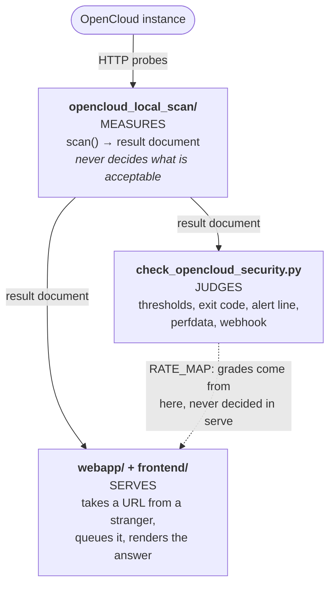

# Arquitectura

Así se organiza el repositorio y estas son las razones de sus límites. Las reglas están en [`AGENTS.md`](../../../AGENTS.md); las decisiones y alternativas descartadas, en [`adr/`](../../../adr/README.md).

## En una frase {#the-one-sentence-version}

Un complemento de supervisión consulta directamente una instancia OpenCloud, calcula una puntuación de `0` a `5` y termina con un estado Nagios. Lo acompañan la biblioteca en la que se basa y un servicio web que ejecuta esa misma biblioteca sin exigir una instalación local.

No existe una API de análisis remota que proporcione el veredicto. La escala `0`–`5` coincide con la API de análisis de Nextcloud únicamente para conservar el significado de los umbrales, gráficos y reglas de alerta existentes.

## Tres capas {#three-layers}

Los límites forman parte del diseño. Un cambio que los desdibuje pertenece a otro archivo, por pequeño que parezca.




### Medir: `opencloud_local_scan/` {#measure-opencloud_local_scan}

La biblioteca del analizador. `scan()` consulta una instancia por HTTP y devuelve un documento de resultados. No conoce WARNING ni CRITICAL.

| Módulo | Responsabilidad |
|:--|:--|
| `scanner.py` | Proceso de análisis, hallazgos, excepciones y puntuación |
| `versions.py` | Ciclo de vida: canales, líneas y fin del soporte |
| `releases.py` | Comprobación de actualizaciones y recomendación según el canal |
| `hardening.py` | Explicación de cada identificador de refuerzo |
| `tls.py` | Seguridad del transporte: protocolo, certificado, cadena, stapling |
| `remediation.py` | Correcciones ordenadas mediante los límites de puntuación |
| `config.py`, `factory.py` | Configuración, secretos y construcción de ajustes |
| `wizard.py`, `selfupdate.py` | `--configure` y `--upgrade-self` |
| `data/release_schedule.json` | Calendario de versiones incluido |

Las claves del resultado usan camelCase: `extraChecks`, `ratingExplanation`, `latestVersionInBranch`, con `EOL` en mayúsculas.

### Evaluar: `check_opencloud_security.py` {#judge-check_opencloud_securitypy}

El complemento administra los umbrales, código de salida, línea de alerta, datos de rendimiento y webhook. Su salida usa snake_case: `failed_extra_checks`, `plugin_version`, `rating_label`.

El orden de inicio es esencial: `_run_early_commands()` → `_preparse_config()` → `_set_configuration()` → `build_arg_parser()` → `parse_args()`. `--host` es obligatorio salvo que lo aporte el entorno. Los modos sin análisis deben interceptarse en `_run_early_commands()`, antes de crear el analizador de argumentos que exige un servidor.

### Servir: `webapp/` y `frontend/` {#serve-webapp-and-frontend}

El servicio público recibe una URL, la entrega al analizador y presenta el resultado. No reimplementa controles ni decide calificaciones: `catalog.summarise()` agrupa el documento existente y las letras proceden de `RATE_MAP` del complemento.

| Módulo | Responsabilidad |
|:--|:--|
| `app.py` | Rutas, cabeceras de seguridad y validación de solicitudes |
| `settings.py` | Variables `COS_WEB_*`, leídas una vez al iniciar |
| `ssrf.py` | Destinos permitidos, comprobados dos veces |
| `ratelimit.py` | Límite por cliente y espera entre análisis de un destino |
| `audit.py` | Registro de auditoría opcional y seudonimizado |
| `store.py` | Espacio Redis por análisis, TTL en cada clave |
| `queue.py`, `tasks.py` | Entrega al proceso ARQ y ejecución |
| `runner.py` | Conversión de una solicitud en `ScannerSettings` |
| `catalog.py` | Excepciones permitidas y agrupación del panel |
| `documentation.py`, `search.py` | Manifiestos de guías públicas y búsqueda |
| `i18n.py`, `locales/` | Idioma por solicitud y cuatro catálogos de textos |
| `reports.py` | CSV, SARIF y PDF generado directamente |
| `redis_backend.py` | Cliente Redis y sustituto en memoria para pruebas |
| `workflows.py` | Tareas: enviar, consultar, esperar, terminar y exportar |
| `openapi.py` | Documento OpenAPI 3.1 escrito explícitamente |
| `arazzo.py` | Descripción de las tareas en Arazzo 1.0.1 |
| `mcp_server.py` | Punto de acceso MCP que ejecuta las mismas tareas para agentes |
| `prompts.py` | Instrucciones de tareas habituales, definidas una sola vez |
| `mcp_auth.py` | Acceso opcional en `/mcp`: verificar tokens, nunca emitirlos |
| `discovery.py` | `/.well-known/ai.json`, que enumera estas interfaces |
| `seo.py` | URL canónicas, `robots.txt` y mapa del sitio generado |
| `purge.py` | Borrado solicitado y justificante de su ejecución |
| `encryption.py` | Cifrado AES-256-GCM opcional de resultados almacenados |

La descripción y el control mediante `/openapi.json`, `/arazzo.json`, `/mcp` y `/.well-known/ai.json` siguen perteneciendo a esta capa; consulte [Interfaces para agentes](#the-agent-facing-surfaces).

`frontend/` contiene plantillas y recursos sin lógica de negocio; `webapp/` no contiene marcado. El navegador carga recursos únicamente desde `/static`. La CSP excluye `unsafe-inline`: no hay estilos, scripts ni controladores de eventos insertados en el documento.

### Localización de la interfaz {#frontend-localization}

Un único conjunto de plantillas sirve inglés, alemán, español y francés. El catálogo inglés es la fuente; los demás conservan las mismas claves, parámetros y marcado. `app.py` asigna un traductor a cada solicitud HTML:

```text
validated cos_locale cookie
          │
          ├── absent ──► weighted Accept-Language
          │
          └── unsupported/absent ──► English
                                      │
                                      ▼
                         shared Jinja templates + <html lang>
```

`POST /language` guarda una cookie `HttpOnly`, `SameSite=Lax` y redirige solo a una ruta local validada. Las páginas varían según `Cookie` y `Accept-Language`. El idioma no aparece en la URL: el UUID de un resultado sigue siendo una única autorización de acceso con una sola dirección.

Solo se traduce el HTML redactado por la aplicación. OpenAPI, Arazzo, MCP, documentos de descubrimiento y exportaciones mantienen contratos estables en inglés. Los valores y errores medidos en una instancia se conservan literalmente. JavaScript recibe textos mediante atributos `data-*` traducidos, sin otro catálogo. Las guías se generan desde fuentes inglesas, alemanas, francesas y españolas (`GUIDE_LANGUAGES`, ADR 0058, 0062, 0063). Un idioma sin fuente recibiría el texto inglés con `lang="en"` y un aviso traducido.

Al publicar, `scripts/build_search_index.py` genera un índice inglés y complementos alemán, español y francés. Solo lo alimenta el manifiesto público: traducir no abre un camino de los resultados a la búsqueda. ADR 0020 documenta el idioma y ADR 0019 el límite de la búsqueda.

## Cómo llegan los ajustes al analizador {#how-settings-reach-the-scanner}

Una dirección, cuatro fuentes y una prioridad:

```text
YAML/JSON file ─┐
environment  ───┼─→ config.Configuration ─→ factory.py ─→ frozen *Settings ─→ scanner
CLI flags    ───┘        (flat COS_ names)     (builds)       (dataclasses)
```

- `config.py` aplana claves: `scanner.target_port` pasa a `SCANNER_TARGET_PORT`, leído como `COS_SCANNER_TARGET_PORT` en el entorno. Las listas se unen con `;`.
- Prioridad: **opción CLI > variable de entorno > archivo > valor predeterminado**. Ambas CLI pasan `None` a `factory.py` para valores no especificados.
- Solo `factory.py` construye `ScannerSettings` y `ReleaseSettings`, ambos inmutables.
- La extensión `.json` determina JSON; cualquier otra, YAML. Decide la extensión, no el contenido.

La aplicación web no participa en esa cadena. Lee sus variables `COS_WEB_*` una vez al iniciar: una solicitud puede elegir qué analizar, nunca con qué intensidad.

## Recorrido de un análisis por la aplicación web {#how-a-scan-flows-through-the-web-application}

```text
POST /api/scans ──► client rate limit ──► SSRF guard ──► waiver allow-list
POST /api/scans/batch  (per target, in order)                 │
                                                              ▼
                                                       target cooldown
                                                              │
                                                    uuid + Redis namespace
                                                              │
                                                          ARQ queue
                                                              │
                                                     worker: validate the
                                                     target again, scan,
                                                     store the result
                                                              │
                          GET /scan/{uuid} ◄───────────────────┤
                          GET /api/scans/{uuid}                │
                          GET /api/scans/{uuid}/export/{fmt} ◄─┘
```

El límite del cliente va primero: un único `INCR` de Redis protege el resolutor utilizado por el filtro SSRF frente a la amplificación. La espera por destino se reserva con `SET NX`, por lo que dos solicitudes simultáneas para la misma instancia no pueden iniciar ambas un análisis. Solo entonces se crea el UUID.

Un lote recorre la misma secuencia para cada destino, en el orden indicado. Ninguno evita límites por ir acompañado; la respuesta identifica qué análisis comenzaron y cuáles no.

La sobrecarga genera una cola: las solicitudes válidas reciben un UUID y esperan en orden FIFO con su posición visible. Nunca reciben un 503.

## Interfaces para agentes {#the-agent-facing-surfaces}

Con solo la dirección del servicio, un agente debe poder descubrir sus funciones y usarlas sin tener el repositorio ni `AGENTS.md`. Cuatro elementos lo permiten; **ninguno contiene controles, límites ni veredictos propios.**

### Una capa de tareas, tres descripciones {#one-workflow-layer-three-descriptions}

```text
                    webapp/workflows.py
             the semantics: submit -> poll -> wait ->
             complete -> export, and the rules for each
                            |
        +-------------------+-------------------+
        v                   v                   v
   openapi.py           arazzo.py          mcp_server.py
   what operations      how they combine   an agent performs
   exist                into a task        the task
        |                   |                   |
   /openapi.json       /arazzo.json           /mcp
```

`workflows.py` define una sola vez los valores y decisiones: `202` al enviar, intervalo de consulta, máximo de intentos, `404` definitivo para un UUID desconocido y `409` al exportar con el significado «todavía no». Arazzo lee esas constantes, MCP llama a esas funciones y las pruebas impiden valores divergentes. Si una descripción contradice la API, la descripción es el error.

`mcp_server.py` llama a **la propia API HTTP dentro del mismo proceso**, a través de la pila ASGI normal. Así mantiene el filtro SSRF, límites, espera por destino, cola y autorización de borrado reales. Un agente no accede a rutas adicionales ni recibe límites más generosos que un navegador. Véase [ADR 0011](../../../adr/0011-mcp-is-an-execution-layer-not-a-second-implementation.md).

Seis herramientas representan **tareas, no puntos de acceso**: `scan_instance`, `scan_instances`, `get_scan_result`, `plan_remediation`, `export_scan`, `erase_instance_data`. Analizar requiere una sola llamada; `workflows.py` realiza las consultas posteriores. Cinco recursos `spec://check-opencloud-security/...` ofrecen referencias dentro del protocolo:

- `openapi`, `arazzo`, `discovery`: los contratos.
- `catalogue`, `advisories`: la **base de conocimientos**, con todos los identificadores de refuerzo y controles adicionales explicados y la base completa de avisos de seguridad. Usan directamente `webapp/catalog.py` y `webapp/advisories.py`, igual que `/catalogue`. Un agente puede explicar un hallazgo o conocer los controles sin enviar un destino ni recibir explicaciones distintas de las de la página.

Seis **instrucciones** nombran tareas habituales: `audit_instance`, `audit_estate`, `explain_scan_result`, `triage_findings`, `review_transport_security`, `check_release_support`. Su texto vive en `prompts.py`, compuesto a partir de notas y constantes de `workflows.py`. Nombra herramientas porque estas aplican los límites. Véase [ADR 0014](../../../adr/0014-prompts-are-tasks-and-their-text-lives-beside-the-workflows.md).

El punto de acceso está **abierto de forma predeterminada**. Para un despliegue interno, configure `COS_WEB_MCP_AUTH_ENABLED` y un emisor. `mcp_auth.py` actúa como servidor de recursos OAuth 2.0: verifica tokens Bearer sin conexión usando las claves publicadas, firma, emisor, audiencia, caducidad y permisos; solo acepta algoritmos asimétricos. Una respuesta `401` indica los metadatos RFC 9728 que identifican al proveedor. El servicio no emite ni almacena tokens ni administra cuentas. `docker/docker-compose.authentik.yml` ofrece una pila alternativa completa con proveedor; el código no conoce su nombre.

**La autenticación decide quién puede solicitar, nunca con qué intensidad.** Todos los límites siguen vigentes tras iniciar sesión. **Si no puede imponer la autenticación solicitada, el despliegue no inicia**, igual que si faltara una clave de cifrado. Servir abierto un acceso que el operador cree protegido sería el peor resultado. Véase [ADR 0015](../../../adr/0015-the-mcp-endpoint-may-require-a-sign-in.md).

### WebMCP en el navegador {#browser-webmcp}

Con MCP activado, las páginas inicial y de resultados exponen sus acciones mediante el [borrador WebMCP](https://webmachinelearning.github.io/webmcp/). Es un adaptador del cliente:

```text
Jinja context -> _webmcp.html -> /static/js/webmcp.js
                                      |
                                      v
                         fetch with Accept: application/json
                                      |
                    +-----------------+------------------+
                    v                 v                  v
             POST /api/scans   GET /api/scans/{uuid}   export route
```

Jinja construye cada JSON Schema desde las opciones de la página. Canales, formatos, identificadores de excepción y exportaciones no pueden divergir en otro catálogo del navegador. Los estados reintentables y plazos también proceden de `webapp/workflows.py`. El script externo registra herramientas tras `DOMContentLoaded` y solo si existe WebMCP. Acepta el anterior `navigator.modelContext` y el actual `document.modelContext`, prefiriendo `provideContext` declarativo cuando esté disponible.

Los fallos se devuelven como `ok: false`, con `status`, `error`, `retryable`, `retryAfter`, en lugar de lanzarse como excepciones. Es el contrato existente de `/mcp` ([ADR 0041](../../../adr/0041-a-browser-tool-answers-a-failure-rather-than-throwing.md)).

La página inicial ofrece `scan_opencloud_security`; la de resultados, `get_scan_result` y `export_scan_report`, ligados a su UUID. Las demás vistas no registran nada. Cada acción usa la API HTTP normal con `Accept: application/json`; las protecciones siguen teniendo una sola implementación. `COS_WEB_ENABLE_MCP=false` elimina los registros del navegador y `/mcp`. ADR 0021 documenta este límite.

### Descubrimiento {#discovery}

El nombre de un archivo no basta para descubrir una interfaz. Por eso un documento las enumera todas:

```text
https://scan.okxo.de
        |
        +--> /llms.txt             short agent-readable map
        +--> /agents.txt           capability declaration (agents-txt.com)
        |
        v
/.well-known/ai.json --+--> /openapi.json   operations
                       +--> /arazzo.json    workflows
                       +--> /mcp            server-side tools + knowledge base
                       +--> /ai             the same thing, for a human
```

`/llms.txt` es un mapa breve con contratos y reglas de interacción, sin resultados, UUID ni credenciales. `/agents.txt` declara las mismas capacidades según [agents-txt.com](https://agents-txt.com): directivas `Key: value` para `MCP`, `WebMCP` y, solo cuando se exige un token, `Authorization`/`Identity`. Las listas de permisos y prohibiciones siguen siendo exclusivas de `/robots.txt`.

Estas convenciones no son estándares registrados. `/.well-known/ai.json` es el documento detallado de **esta aplicación**, situado donde los clientes buscan. Es breve: nombre, descripción y URL absolutas. `base.html` añade relaciones de enlace `service-desc` y `arazzo`. `/ai` explica lo mismo con prosa y enlaces para personas y rastreadores HTML.

Las descripciones son públicas, sin autenticación y con rutas estables. `COS_WEB_ENABLE_DOCS` controla solo `/docs` y `/redoc`, nunca los JSON ([ADR 0010](../../../adr/0010-machine-readable-descriptions-are-always-public.md)). `COS_WEB_ENABLE_MCP` desactiva el acceso MCP; el descubrimiento deja entonces de anunciarlo.

### Lo que MCP no puede hacer {#what-mcp-may-not-do}

El punto de acceso se trata como una entrada al servicio.

- **No es una segunda implementación:** no debe repetir controles, relajar límites ni decidir notas en `mcp_server.py`.
- **No evita límites:** cada llamada cuenta contra su dirección de origen real. La dirección de bucle local predeterminada del transporte agruparía a todos los agentes. `COS_WEB_MCP_MAX_CONCURRENT_WAITS` limita llamadas en espera. Al alcanzarlo, el análisis se envía igualmente y se devuelve su UUID con una indicación para consultarlo.
- **No transmite órdenes de la instancia al modelo:** versiones, productos y errores provienen de otro servidor. Se normalizan, limpian y truncan. Un bloque `untrusted` identifica datos que deben comunicarse, nunca obedecerse.
- **No conserva credenciales:** `erase_instance_data` se marca como destructiva y exige la autorización de la API. MCP no aporta, registra ni devuelve esas credenciales.
- **Valida el UUID antes de incorporarlo a una ruta:** un cliente HTTP resuelve `..`; `../../healthz` no es un análisis.

## Concurrencia {#concurrency}

Por punto de llamada y nunca anidada.

- `_run_all(settings, tasks)` crea su propio `ThreadPoolExecutor`; `pool.map` conserva el orden de envío, protegido por pruebas.
- Se excluye el paralelismo por grupos en `_collect_extra_findings`, porque multiplicaría los trabajadores.
- El valor predeterminado `1` implica ejecución estrictamente secuencial.
- `requests.Session` no es segura entre hilos. `_Probe` mantiene una sesión `threading.local` por trabajador y un identificador `_owner`. Use `_Probe.derive(url)` para otra URL base; nunca comparta sesiones manualmente.
- `COS_WEB_MAX_WORKERS` fija análisis simultáneos y `COS_WEB_SCAN_CONCURRENCY` las comprobaciones dentro de cada análisis. Una solicitud no puede modificar ninguno.

## Estado y duración {#state-and-its-lifetime}

El complemento no conserva estado. La aplicación web conserva el mínimo:

- Tres claves Redis por análisis, `scan:{uuid}:status|result|metadata`, todas con TTL, y una lista compartida de UUID pendientes para calcular posiciones.
- **El UUID concede acceso.** No hay un punto de listado, identificadores adivinables ni acceso a claves de otro análisis. Desconocido, inválido y caducado producen el mismo 404.
- Los logs contienen marcadores de ciclo de vida y un UUID. La auditoría opcional de `audit.py`, desactivada por defecto, registra huellas en lugar de direcciones ([ADR 0004](../../../adr/0004-webapp-audit-logging.md)).
- Los resultados no se almacenan en caché ([ADR 0002](../../../adr/0002-no-scan-result-caching.md)); la disponibilidad depende del latido del trabajador, no de comprobar un proceso ([ADR 0003](../../../adr/0003-worker-health-heartbeat.md)).
- Todo caduca automáticamente; `DELETE /api/purge` permite borrar antes. No existe un mapa de destinos a análisis. El borrado recorre las claves; otro recorrido posterior calcula `remaining` para el justificante ([ADR 0007](../../../adr/0007-erasure-on-request.md)).
- `COS_WEB_ENCRYPT_RESULTS` cifra resultados con AES-256-GCM. Sin una clave válida, un proceso configurado para cifrar se niega a iniciar en vez de escribir texto sin cifrar ([ADR 0008](../../../adr/0008-refuse-to-start-without-the-encryption-key.md)).

## Puntuación {#the-rating}

Parte de la versión y la base de avisos; después, los controles fallidos la limitan (`SEVERITY_RATING_CAP`: crítica 2, alta 3, media 4, baja 5). Dos invariantes tienen pruebas:

- **La explicación no depende del orden de iteración.** Un límite se considera aplicado cuando coincide con la puntuación final.
- **El fin del soporte prevalece sobre todo**, incluida una excepción global. Una versión sin parches de seguridad recibe F.

`remediation.py` estima el beneficio de cada corrección repitiendo el mismo cálculo y retirando un hallazgo cada vez. El plan se deriva del resultado, no se almacena aparte y solo contiene números. La capa evaluadora sigue asignando las letras ([ADR 0012](../../../adr/0012-the-remediation-plan-is-derived-not-stored.md)).

Una excepción suprime la alerta, no las pruebas. El hallazgo permanece con `"ignored": true`. Solo puede exceptuarse un control que haya fallado, para no ocultar una regresión futura.

Los hallazgos imposibles de corregir por estar fijados en OpenCloud llevan `actionable=False` en `hardening.py`. Permanecen en el resultado, pero no en la alerta, la métrica `hardenings_missing` ni el webhook.

## Ciclo de vida de las versiones {#the-release-lifecycle}

OpenCloud publica Rolling (unas tres semanas), Production (unos seis meses) y LTS (dos años) en paralelo. Las versiones forman **líneas** `MAJOR.MINOR`; una línea puede pertenecer a varios canales.

- Rolling y Production caducan al publicarse la siguiente versión del mismo canal; LTS caduca por fecha.
- **Una versión más nueva puede tener menos soporte que una antigua.** Es parte del modelo.
- **Estar por delante del canal no es fin del soporte.** Solo las versiones anteriores a la actual del canal carecen de soporte.
- Las recomendaciones avanzan siempre y nunca trasladan Production o LTS a Rolling.

`scripts/update_release_schedule.py` regenera `opencloud_local_scan/data/release_schedule.json` y el bloque entre marcas `release-schedule` de `README.md`. Ambos se confirman juntos y nunca se editan a mano.

### Incorporar una nueva versión OpenCloud {#updating-for-a-new-opencloud-release}

Los datos de publicación se incorporan automáticamente, pero la compatibilidad requiere revisión en todos los canales:

1. **Empiece por las pruebas.** `release-schedule.yml` o `uv run python scripts/update_release_schedule.py` lee la página oficial del ciclo de vida. El flujo abre una PR solo con el calendario y la tabla README generada. No los edite a mano ni deduzca canales de números de versión.
2. **Revise el cambio por canal.** El sucesor Rolling o Production deja sin soporte a la línea anterior. Para LTS, compruebe fecha inicial y plazo de dos años. Los nuevos parches no deben borrar canales ni fechas conocidas. Un refresco rechazado es una señal de seguridad, no una razón para relajar reglas.
3. **Evalúe la imagen del proveedor por separado.** Ejecute `real OpenCloud container` con el digest inmutable en `candidate_image`. Inicializa la imagen y analiza su estado público. Anote la versión y revise fallos de detección, TLS, cabeceras, redirecciones de autenticación, endpoints expuestos, pruebas de refuerzo y nota.
4. **Relacione los cambios con el analizador.** Compare con `tests/fake_opencloud.py`, `tests/test_local_scanner.py` y pruebas TLS y de refuerzo. Cambie fixtures o expectativas solo con pruebas de la versión que expliquen comportamiento anterior, nuevo, versión afectada y regla. Nunca elimine aserciones ni rebaje notas o amplíe tolerancias para aceptar al candidato.
5. **Añada solo controles observables y corregibles.** Mediciones en `opencloud_local_scan/`, evaluación en el complemento. Confirme en el código OpenCloud que el operador puede cambiar el ajuste. Añada pruebas positivas y negativas, documentación humana y de máquina, y ADR solo si cambia un límite duradero.
6. **Revise también los avisos.** Ejecute o espere `vulnerability-db.yml`. Su PR puede ampliar rangos, nunca quitar avisos ni rangos conocidos. Contraste cada rango nuevo con su fuente antes de fusionar.
7. **Adopte deliberadamente.** Tras revisar ciclo de vida, avisos, analizador y pruebas completas, actualice el digest revisado mediante una PR normal. Ejecute `uv run pytest`, `uvx ruff check .`, `uv run mypy --config-file mypy.ini`, validación documental y prueba del contenedor candidato. El diff documenta la compatibilidad; no cambie datos, fixtures ni versiones directamente en producción.

## Qué se distribuye y dónde {#what-ships-where}

| Artefacto | Contenido | Construcción |
|:--|:--|:--|
| Wheel PyPI y sdist | Complemento y `opencloud_local_scan/` | `hatch`, sin `webapp/` ni `frontend/` |
| `check_opencloud_security_web.tar.gz` | Aplicación web e interfaz | `scripts/build_web_bundle.py` |
| `docker/Dockerfile` | Complemento y servicio de análisis | Flujo de publicación |
| `docker/Dockerfile.web` | Wheel, extras `web` y `mcp`, `webapp/`, `frontend/` | Flujo de publicación |

Instalar el complemento no debe incorporar FastAPI, Redis ni ARQ. `tests/test_webapp_packaging.py` construye los artefactos reales para comprobarlo.

La versión tiene una sola fuente: `pyproject.toml`. `opencloud_local_scan.__version__` la deriva y el complemento la importa. No fije ese número en otro lugar.

Todos los archivos Docker están en `docker/`; el contexto es la raíz del repositorio porque las imágenes necesitan archivos exteriores a esa carpeta. `.dockerignore` permanece en la raíz.

## Estrategia de pruebas {#testing-strategy}

- `tests/fake_opencloud.py` es un servidor HTTP real controlado por `InstanceBehaviour`. Las expectativas proceden de un análisis real; las listas fijadas a mano envejecen.
- `tests/test_e2e_cli.py` ejecuta el complemento como subproceso con un entorno limpio, igual que un demonio de supervisión.
- `tests/webapp_support.py` ofrece Redis aislado en memoria y un resolutor sin conexión por prueba. `COS_WEB_REDIS_URL=memory://` evita necesitar un servidor Redis.
- `tests/test_webapp_mcp.py`, `test_webapp_workflows.py`, `test_webapp_openapi.py`, `test_webapp_arazzo.py`, `test_webapp_discovery.py` verifican los `operationPath`, la concordancia con `workflows.py` y los mismos límites para herramientas y solicitudes.
- Los nombres describen el comportamiento protegido. Deben comprobar casos positivos y negativos; una aserción que pasa sin la función no la protege.

## Dónde añadir elementos {#where-to-add-things}

**Nuevo control:** en `opencloud_local_scan/`, con explicación en `hardening.py`, tras comprobar en OpenCloud que el operador puede cambiar el ajuste.

**Nuevo ajuste del complemento:** `config.py` solo si hay una ruta predeterminada nueva, `factory.py`, opción en `check_opencloud_security.py`, subcomando en `opencloud_local_scan/cli.py`, pregunta en `wizard.py`, tabla README, `config/check-opencloud-security.example.yml` y `CHANGELOG.md`. `RELEASE.md` se genera al publicar.

**Nuevo ajuste `COS_WEB_*`:** campo de `WebSettings` que explique por qué no lo configura el cliente, lectura en `from_env`, fila en `docs/webapp.md`, entrada en `docker/docker-compose.yml` y registro de cambios.

**Nuevo endpoint API:** operación en `webapp/openapi.py`, tarea o paso Arazzo si cambia el uso, filas en las tablas de `webapp/README.md` y `docs/webapp.md`.

**Nueva herramienta MCP:** tarea y reglas en `webapp/workflows.py`; exposición en `webapp/mcp_server.py` mediante la API HTTP dentro del proceso. Describa finalidad, entradas, duración, reintentos y efectos destructivos. Complete tablas de `docs/mcp.md`, `webapp/README.md`, `docs/webapp.md` y una prueba en `tests/test_webapp_mcp.py` que garantice los mismos límites de la API.

**Nuevo recurso MCP:** referencia sin argumentos ni cambio de estado; de lo contrario, es una herramienta. Reutilice `webapp/catalog.py` o `webapp/advisories.py`, una URI `spec://check-opencloud-security/...`, las mismas tablas y pruebas, sin destino de análisis en la firma.

**Nueva herramienta WebMCP:** acción ya disponible en la página. Esquema desde el catálogo del servidor, registro por `_webmcp.html` y ejecución mediante la API JSON pública. Una prueba debe excluir ajustes exclusivos del servidor del esquema.

**Decisión duradera:** los límites de capas, interfaces públicas, seguridad, despliegue, ciclo de datos y dependencias duraderas requieren un ADR con el siguiente número nunca usado. Sustituya decisiones con registros nuevos, sin reescribir la historia.
