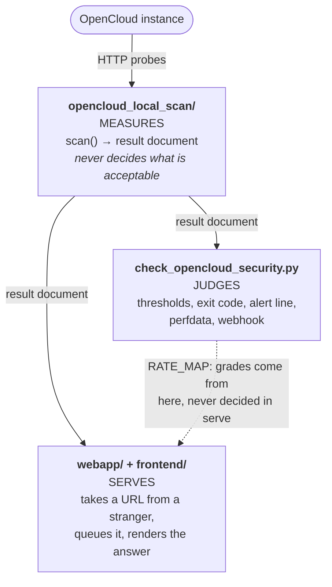

# Architecture

Ce document explique l’organisation du dépôt et les raisons de ses frontières. Les règles figurent dans [`AGENTS.md`](../../../AGENTS.md) ; les décisions et les solutions écartées se trouvent dans [`adr/`](../../../adr/README.md).

## En une phrase {#the-one-sentence-version}

Un plugin de supervision interroge directement une instance OpenCloud, calcule une note de `0` à `5`, puis renvoie un état Nagios. Il s’appuie sur une bibliothèque également utilisée par un service web, pour les personnes qui ne souhaitent rien installer.

Aucune API d’analyse distante ne fournit de verdict. L’échelle `0`–`5` reprend uniquement celle de l’API d’analyse Nextcloud pour conserver le sens des seuils, graphiques et règles d’alerte existants.

## Trois couches {#three-layers}

Les frontières constituent l’architecture. Une modification qui les brouille appartient à un autre fichier, même si elle paraît mineure.




### Mesurer : `opencloud_local_scan/` {#measure-opencloud_local_scan}

La bibliothèque d’analyse. `scan()` sonde une instance par HTTP et renvoie un document de résultat. Elle ne connaît ni WARNING ni CRITICAL.

| Module | Responsabilité |
|:--|:--|
| `scanner.py` | Déroulement de l’analyse, constats, dérogations et note |
| `versions.py` | Cycle de vie : canaux, branches, fin de prise en charge |
| `releases.py` | Vérification des mises à jour et recommandation adaptée au canal |
| `hardening.py` | Explication de chaque identifiant de durcissement |
| `tls.py` | Sécurité du transport : protocole, certificat, chaîne, agrafage |
| `remediation.py` | Liste ordonnée des corrections, calculée avec les plafonds de notation |
| `config.py`, `factory.py` | Configuration, secrets et construction des paramètres |
| `wizard.py`, `selfupdate.py` | `--configure` et `--upgrade-self` |
| `data/release_schedule.json` | Calendrier des versions fourni |

Les clés des résultats utilisent camelCase : `extraChecks`, `ratingExplanation`, `latestVersionInBranch`, avec `EOL` en majuscules.

### Évaluer : `check_opencloud_security.py` {#judge-check_opencloud_securitypy}

Le plugin possède les seuils, le code de sortie, la ligne d’alerte, les données de performance et le webhook. Sa sortie utilise snake_case : `failed_extra_checks`, `plugin_version`, `rating_label`.

L’ordre de démarrage est essentiel : `_run_early_commands()` → `_preparse_config()` → `_set_configuration()` → `build_arg_parser()` → `parse_args()`. `--host` est obligatoire si l’environnement ne le fournit pas. Tout mode sans analyse doit donc être intercepté dans `_run_early_commands()`, avant de construire le parseur qui exige un hôte.

### Servir : `webapp/` et `frontend/` {#serve-webapp-and-frontend}

Le service public reçoit une URL, la transmet à l’analyseur et affiche le résultat. Il ne réimplémente aucun contrôle et ne décide aucune note : `catalog.summarise()` regroupe le document existant, et les lettres viennent de `RATE_MAP` dans le plugin.

| Module | Responsabilité |
|:--|:--|
| `app.py` | Routes, en-têtes de sécurité, validation des requêtes |
| `settings.py` | Variables `COS_WEB_*`, lues une fois au démarrage |
| `ssrf.py` | Destinations autorisées, vérifiées deux fois |
| `ratelimit.py` | Limite par client et délai entre analyses d’une cible |
| `audit.py` | Journal d’audit facultatif et pseudonymisé |
| `store.py` | Espace Redis par analyse, durée de vie sur chaque clé |
| `queue.py`, `tasks.py` | Transmission au processus ARQ et exécution |
| `runner.py` | Conversion d’une requête en `ScannerSettings` |
| `catalog.py` | Dérogations autorisées et regroupement du tableau de bord |
| `documentation.py`, `search.py` | Manifestes des guides publics et de recherche |
| `i18n.py`, `locales/` | Choix de langue par requête et quatre catalogues de textes |
| `reports.py` | CSV, SARIF et PDF produit directement |
| `redis_backend.py` | Client Redis et remplacement en mémoire pour les tests |
| `workflows.py` | Tâches : soumettre, interroger, attendre, terminer, exporter |
| `openapi.py` | Document OpenAPI 3.1 écrit explicitement |
| `arazzo.py` | Description des tâches en Arazzo 1.0.1 |
| `mcp_server.py` | Point d’accès MCP exécutant ces mêmes tâches pour un agent |
| `prompts.py` | Consignes correspondant aux tâches demandées, définies une fois |
| `mcp_auth.py` | Connexion facultative à `/mcp` : vérifier un jeton, jamais l’émettre |
| `discovery.py` | `/.well-known/ai.json`, qui référence ces interfaces |
| `seo.py` | URL canoniques, `robots.txt` et plan du site généré |
| `purge.py` | Effacement sur demande et reçu de confirmation |
| `encryption.py` | Chiffrement AES-256-GCM facultatif des résultats stockés |

L’autodescription et le pilotage par agent via `/openapi.json`, `/arazzo.json`, `/mcp` et `/.well-known/ai.json` restent dans cette couche : voir [Interfaces pour les agents](#the-agent-facing-surfaces).

`frontend/` contient les modèles et ressources, sans logique métier ; `webapp/` ne contient pas de balisage. Le navigateur charge uniquement des ressources de `/static`. La CSP exclut `unsafe-inline` : aucun style, script ou gestionnaire d’événement intégré.

### Localisation de l’interface {#frontend-localization}

Un seul ensemble de modèles sert l’anglais, l’allemand, l’espagnol et le français. L’anglais est le catalogue source ; les traductions conservent les mêmes clés, paramètres et balises. `app.py` associe un traducteur à chaque requête HTML :

```text
validated cos_locale cookie
          │
          ├── absent ──► weighted Accept-Language
          │
          └── unsupported/absent ──► English
                                      │
                                      ▼
                         shared Jinja templates + <html lang>
```

`POST /language` enregistre un cookie `HttpOnly`, `SameSite=Lax` et redirige uniquement vers un chemin local validé. Les pages varient selon `Cookie` et `Accept-Language`. La langue n’apparaît pas dans l’URL : l’UUID d’un résultat reste une seule autorisation d’accès à une seule adresse.

Seul le HTML rédigé par l’application est traduit. OpenAPI, Arazzo, MCP, documents de découverte et exports restent des contrats stables en anglais. Les valeurs et erreurs mesurées sur une instance restent intactes. JavaScript reçoit ses textes par les attributs `data-*` traduits, sans second catalogue. Les guides proviennent de sources anglaises, allemandes, françaises et espagnoles (`GUIDE_LANGUAGES`, ADR 0058, 0062, 0063). Une langue sans source recevrait le texte anglais avec `lang="en"` et un avertissement traduit.

Lors de la publication, `scripts/build_search_index.py` génère un index anglais et des compléments allemand, espagnol et français. Seul le manifeste public l’alimente ; la traduction ne crée aucun passage des résultats vers la recherche. ADR 0020 décrit la langue, ADR 0019 la frontière de la recherche.

## Acheminement des paramètres vers l’analyseur {#how-settings-reach-the-scanner}

Une direction, quatre sources et un ordre de priorité :

```text
YAML/JSON file ─┐
environment  ───┼─→ config.Configuration ─→ factory.py ─→ frozen *Settings ─→ scanner
CLI flags    ───┘        (flat COS_ names)     (builds)       (dataclasses)
```

- `config.py` aplatit les clés : `scanner.target_port` devient `SCANNER_TARGET_PORT`, lu dans l’environnement sous `COS_SCANNER_TARGET_PORT`. Les listes sont jointes par `;`.
- Priorité : **option CLI > variable d’environnement > fichier > valeur par défaut**. Les deux CLI transmettent `None` à `factory.py` pour les valeurs non précisées.
- Seul `factory.py` construit `ScannerSettings` et `ReleaseSettings`, tous deux immuables.
- L’extension `.json` impose JSON ; toute autre extension impose YAML. Le contenu ne décide pas du format.

L’application web ne suit pas cette chaîne. Ses variables `COS_WEB_*` sont lues au démarrage : une requête choisit la cible, jamais l’intensité de l’analyse.

## Parcours d’une analyse dans l’application web {#how-a-scan-flows-through-the-web-application}

```text
POST /api/scans ──► client rate limit ──► SSRF guard ──► waiver allow-list
POST /api/scans/batch  (per target, in order)                 │
                                                              ▼
                                                       target cooldown
                                                              │
                                                    uuid + Redis namespace
                                                              │
                                                          ARQ queue
                                                              │
                                                     worker: validate the
                                                     target again, scan,
                                                     store the result
                                                              │
                          GET /scan/{uuid} ◄───────────────────┤
                          GET /api/scans/{uuid}                │
                          GET /api/scans/{uuid}/export/{fmt} ◄─┘
```

La limite client vient d’abord : un seul `INCR` Redis protège le résolveur utilisé par le filtre SSRF contre l’amplification. Le délai par cible est réservé avec `SET NX`, empêchant deux requêtes simultanées de démarrer pour la même instance. L’UUID n’est créé qu’ensuite.

Un lot suit cette même chaîne pour chaque cible, dans l’ordre fourni. Aucun membre du lot ne contourne une limite ; la réponse distingue les analyses démarrées des autres.

En surcharge, les requêtes valides sont acceptées, reçoivent un UUID et attendent en FIFO avec leur position affichée. Elles ne reçoivent jamais de 503.

## Interfaces pour les agents {#the-agent-facing-surfaces}

À partir de la seule adresse du service, un agent doit pouvoir découvrir ses fonctions et les utiliser sans disposer du dépôt ni de `AGENTS.md`. Quatre éléments le permettent ; **aucun ne possède ses propres contrôles, limites ou verdicts.**

### Une couche de tâches, trois descriptions {#one-workflow-layer-three-descriptions}

```text
                    webapp/workflows.py
             the semantics: submit -> poll -> wait ->
             complete -> export, and the rules for each
                            |
        +-------------------+-------------------+
        v                   v                   v
   openapi.py           arazzo.py          mcp_server.py
   what operations      how they combine   an agent performs
   exist                into a task        the task
        |                   |                   |
   /openapi.json       /arazzo.json           /mcp
```

`workflows.py` définit une seule fois les constantes et décisions : `202` à la soumission, intervalle d’interrogation, nombre maximal d’essais, caractère définitif du `404` pour un UUID inconnu et sens « pas encore » du `409` à l’export. Arazzo lit ces constantes, MCP appelle ces fonctions et les tests interdisent des chiffres divergents. Si la description contredit l’API, la description est erronée.

`mcp_server.py` appelle **l’API HTTP du service dans le même processus**, par la pile ASGI normale. Filtre SSRF, limites, délai par cible, file et autorisation d’effacement restent ainsi les mêmes. Un agent n’accède à aucun chemin supplémentaire et ne bénéficie d’aucune limite supérieure à celle du navigateur. Voir [ADR 0011](../../../adr/0011-mcp-is-an-execution-layer-not-a-second-implementation.md).

Six outils représentent des **tâches, pas des points d’accès** : `scan_instance`, `scan_instances`, `get_scan_result`, `plan_remediation`, `export_scan`, `erase_instance_data`. Une analyse demande un seul appel ; `workflows.py` gère les interrogations successives. Cinq ressources `spec://check-opencloud-security/...` fournissent les références sans quitter le protocole :

- `openapi`, `arazzo`, `discovery` décrivent les contrats.
- `catalogue`, `advisories` forment une **base de connaissances** : tous les identifiants de durcissement et contrôles supplémentaires, avec leurs explications, et la base complète d’avis de sécurité. Elles appellent `webapp/catalog.py` et `webapp/advisories.py`, comme `/catalogue`. Un agent peut expliquer un constat ou consulter les contrôles sans soumettre de cible ni recevoir une autre explication que celle de la page.

Six **consignes** décrivent les tâches usuelles : `audit_instance`, `audit_estate`, `explain_scan_result`, `triage_findings`, `review_transport_security`, `check_release_support`. Leur texte réside dans `prompts.py`, composé à partir des notes et constantes de `workflows.py`. Elles citent des outils, car les outils appliquent les limites. Voir [ADR 0014](../../../adr/0014-prompts-are-tasks-and-their-text-lives-beside-the-workflows.md).

Le point d’accès est **ouvert par défaut**. Pour un déploiement interne, configurez `COS_WEB_MCP_AUTH_ENABLED` et un émetteur. `mcp_auth.py` devient un serveur de ressources OAuth 2.0 : vérification hors ligne du jeton Bearer avec les clés publiées, signature, émetteur, audience, expiration et portées, uniquement avec des algorithmes asymétriques. Une réponse `401` indique les métadonnées RFC 9728, qui désignent le fournisseur. Le service n’émet ni ne conserve de jeton et ne gère aucun compte. `docker/docker-compose.authentik.yml` propose une pile alternative complète avec fournisseur ; le code applicatif ne connaît pas son nom.

**L’authentification décide qui peut demander, jamais avec quelle intensité.** Les limites restent identiques après connexion. **Un déploiement incapable d’appliquer l’authentification demandée refuse de démarrer**, comme celui auquel manque une clé de chiffrement. Servir ouvert un point d’accès supposé protégé serait le pire résultat. Voir [ADR 0015](../../../adr/0015-the-mcp-endpoint-may-require-a-sign-in.md).

### WebMCP dans le navigateur {#browser-webmcp}

Lorsque MCP est activé, les pages d’accueil et de résultat exposent leurs actions selon le [projet WebMCP](https://webmachinelearning.github.io/webmcp/). Il s’agit d’un adaptateur côté client :

```text
Jinja context -> _webmcp.html -> /static/js/webmcp.js
                                      |
                                      v
                         fetch with Accept: application/json
                                      |
                    +-----------------+------------------+
                    v                 v                  v
             POST /api/scans   GET /api/scans/{uuid}   export route
```

Jinja construit les JSON Schemas à partir des options affichées. Canaux, formats, identifiants de dérogation et exports ne peuvent donc pas diverger dans un catalogue de navigateur séparé. Les codes réessayables et délais viennent aussi de `webapp/workflows.py`. Le script externe enregistre les outils après `DOMContentLoaded`, seulement si WebMCP existe. Il accepte l’ancien `navigator.modelContext` et l’actuel `document.modelContext`, en privilégiant `provideContext` déclaratif lorsqu’il est disponible.

Les échecs sont retournés sous forme `ok: false`, avec `status`, `error`, `retryable`, `retryAfter`, plutôt que levés comme exceptions. C’est le contrat déjà utilisé par `/mcp` ([ADR 0041](../../../adr/0041-a-browser-tool-answers-a-failure-rather-than-throwing.md)).

L’accueil expose `scan_opencloud_security`. Le résultat expose `get_scan_result` et `export_scan_report`, liés à son UUID. Les autres vues n’enregistrent rien. Chaque action utilise l’API HTTP normale avec `Accept: application/json` : les protections restent uniques. `COS_WEB_ENABLE_MCP=false` retire les outils du navigateur et le point d’accès `/mcp`. ADR 0021 décrit cette frontière.

### Découverte {#discovery}

Le nom d’un fichier ne suffit pas pour découvrir une interface. Un document les référence donc toutes :

```text
https://scan.okxo.de
        |
        +--> /llms.txt             short agent-readable map
        +--> /agents.txt           capability declaration (agents-txt.com)
        |
        v
/.well-known/ai.json --+--> /openapi.json   operations
                       +--> /arazzo.json    workflows
                       +--> /mcp            server-side tools + knowledge base
                       +--> /ai             the same thing, for a human
```

`/llms.txt` fournit une carte courte, les contrats et les règles d’interaction, sans résultat, UUID ni identifiant secret. `/agents.txt` décrit les mêmes capacités au format [agents-txt.com](https://agents-txt.com) : directives `Key: value` pour `MCP`, `WebMCP` et, seulement si un jeton est requis, `Authorization`/`Identity`. Les listes d’autorisation et d’interdiction restent dans `/robots.txt`.

Ces conventions ne sont pas des normes enregistrées. `/.well-known/ai.json` est le document détaillé de **cette application** ; son emplacement est celui que consultent les clients. Il reste court : nom, description, URL absolues. `base.html` ajoute les relations de liens `service-desc` et `arazzo`. `/ai` donne les mêmes informations en prose et liens cliquables pour les personnes et robots qui lisent le HTML.

Toutes les descriptions restent publiques sans authentification à des chemins stables. `COS_WEB_ENABLE_DOCS` contrôle uniquement `/docs` et `/redoc`, jamais les JSON ([ADR 0010](../../../adr/0010-machine-readable-descriptions-are-always-public.md)). `COS_WEB_ENABLE_MCP` désactive le point d’accès MCP ; la découverte cesse alors de l’annoncer.

### Ce que MCP ne doit pas faire {#what-mcp-may-not-do}

Ce point d’accès est traité comme une entrée dans le service.

- **Aucune seconde implémentation :** ni contrôle réécrit, ni limite assouplie, ni note décidée dans `mcp_server.py`.
- **Aucun contournement des limites :** chaque appel est compté pour son adresse réelle. L’adresse de boucle locale par défaut du transport regrouperait sinon tous les agents. `COS_WEB_MCP_MAX_CONCURRENT_WAITS` borne les appels en attente. À la limite, l’analyse est tout de même soumise et l’UUID revient avec une indication d’interrogation ultérieure.
- **Aucun canal de commande de la cible vers le modèle :** versions, noms de produits et erreurs viennent d’un serveur tiers. Ils sont normalisés, nettoyés et tronqués. Un bloc `untrusted` indique qu’il faut les rapporter, jamais leur obéir.
- **Aucune conservation d’identifiants :** `erase_instance_data` est signalé comme destructif et exige la même autorisation que l’API. MCP ne fournit, ne journalise ni ne renvoie ces identifiants.
- **Validation de l’UUID avant insertion dans un chemin :** un client HTTP résout `..` ; `../../healthz` n’est pas une analyse.

## Concurrence {#concurrency}

Par site d’appel, jamais imbriquée.

- `_run_all(settings, tasks)` crée son `ThreadPoolExecutor`. `pool.map` conserve l’ordre de soumission, garanti par les tests.
- Le parallélisme par groupe dans `_collect_extra_findings` est exclu pour éviter de multiplier les processus de travail.
- La valeur par défaut `1` signifie une exécution strictement séquentielle.
- `requests.Session` n’est pas sûre entre threads. `_Probe` utilise une session `threading.local` par thread et mémorise `_owner`. Pour une deuxième URL de base, utilisez `_Probe.derive(url)` ; ne partagez jamais une session manuellement.
- Le service web utilise `COS_WEB_MAX_WORKERS` pour les analyses simultanées et `COS_WEB_SCAN_CONCURRENCY` pour les sondes d’une analyse. Une requête ne peut modifier ni l’un ni l’autre.

## État et durée de conservation {#state-and-its-lifetime}

Le plugin ne conserve aucun état. L’application web en conserve le minimum :

- Trois clés Redis par analyse, `scan:{uuid}:status|result|metadata`, chacune avec TTL, et une liste commune des UUID en attente pour leur position.
- **L’UUID confère l’accès.** Aucun point d’accès de liste, aucun identifiant devinable et aucun accès aux clés d’une autre analyse. Inconnu, invalide et expiré donnent le même 404.
- Les logs contiennent des marqueurs de cycle de vie et un UUID. Seul l’audit facultatif de `audit.py`, désactivé par défaut, enregistre des empreintes plutôt que des adresses ([ADR 0004](../../../adr/0004-webapp-audit-logging.md)).
- Aucun cache de résultats ([ADR 0002](../../../adr/0002-no-scan-result-caching.md)). La disponibilité dépend du signal de vie du processus de travail, pas de la présence d’un processus ([ADR 0003](../../../adr/0003-worker-health-heartbeat.md)).
- Tout expire automatiquement ; `DELETE /api/purge` peut effacer plus tôt. Aucune table ne relie une cible à ses analyses. L’effacement parcourt donc les clés et un second parcours calcule `remaining` dans le reçu ([ADR 0007](../../../adr/0007-erasure-on-request.md)).
- `COS_WEB_ENCRYPT_RESULTS` chiffre les résultats avec AES-256-GCM. Sans clé utilisable, un processus configuré pour chiffrer refuse de démarrer plutôt que d’écrire en clair ([ADR 0008](../../../adr/0008-refuse-to-start-without-the-encryption-key.md)).

## Notation {#the-rating}

La note part de la version et des avis de sécurité, puis les échecs la plafonnent (`SEVERITY_RATING_CAP` : critique 2, élevée 3, moyenne 4, faible 5). Deux invariants sont testés :

- **L’explication ne dépend pas de l’ordre d’itération.** Un plafond est appliqué lorsqu’il égale la note finale.
- **La fin de prise en charge prime sur tout**, même une dérogation globale. Une version sans correctifs de sécurité reçoit F.

`remediation.py` estime les bénéfices de chaque correction en rejouant le même calcul avec un constat retiré à la fois. Le plan est dérivé du résultat, sans stockage supplémentaire, et ne contient que des nombres. Les lettres restent ajoutées par la couche d’évaluation ([ADR 0012](../../../adr/0012-the-remediation-plan-is-derived-not-stored.md)).

Une dérogation supprime l’alerte, pas les preuves. Le constat reste avec `"ignored": true`. Seul un contrôle réellement échoué peut être exempté, pour ne pas masquer une régression ultérieure.

Les constats impossibles à corriger, car codés en dur dans OpenCloud, portent `actionable=False` dans `hardening.py`. Ils restent dans le résultat, mais pas dans l’alerte, la métrique `hardenings_missing` ni le webhook.

## Cycle de vie des versions {#the-release-lifecycle}

OpenCloud publie en parallèle Rolling (environ trois semaines), Production (environ six mois) et LTS (deux ans). Les versions sont regroupées en **branches** `MAJOR.MINOR`, pouvant appartenir à plusieurs canaux.

- Rolling et Production expirent à la publication suivante du même canal ; LTS expire à date fixe.
- **Une version plus récente peut être moins bien prise en charge qu’une ancienne.** C’est le modèle.
- **Être en avance sur son canal ne signifie pas être en fin de vie.** Seules les versions en retard sur la version courante du canal sont non prises en charge.
- Les recommandations vont uniquement vers l’avant et ne déplacent jamais Production ou LTS vers Rolling.

`scripts/update_release_schedule.py` régénère `opencloud_local_scan/data/release_schedule.json` et le bloc délimité par `release-schedule` dans `README.md`. Ils sont commités ensemble et jamais modifiés à la main.

### Prise en charge d’une nouvelle version OpenCloud {#updating-for-a-new-opencloud-release}

Le dépôt apprend les faits de publication automatiquement, mais la compatibilité exige une revue, quel que soit le canal :

1. **Commencez par les preuves.** `release-schedule.yml` ou `uv run python scripts/update_release_schedule.py` lit la page officielle du cycle de vie. Le workflow ouvre une PR limitée au calendrier et au tableau README généré. Ne modifiez ni l’un ni l’autre manuellement et ne déduisez jamais un canal d’un numéro de version.
2. **Vérifiez le changement par canal.** Le successeur Rolling ou Production met fin à la prise en charge précédente. Pour LTS, vérifiez la date de début et les deux ans de support. Un nouveau correctif ne doit pas faire disparaître les canaux ou dates connus. Un rafraîchissement refusé est un signal de sécurité, pas une raison d’assouplir la règle.
3. **Évaluez séparément l’image de l’éditeur.** Lancez `real OpenCloud container` avec un digest immuable dans `candidate_image`. Le workflow initialise l’image et analyse son point d’accès de statut public. Notez la version et examinez les échecs de détection, TLS, en-têtes, redirections d’authentification, points exposés, preuves de durcissement et note.
4. **Reliez les changements à l’analyseur.** Comparez avec `tests/fake_opencloud.py`, `tests/test_local_scanner.py`, les tests TLS et de durcissement. Toute modification de fixture ou d’attente doit expliquer l’ancien comportement, le nouveau, la version et la règle concernée. Ne retirez aucune assertion et n’assouplissez ni note ni tolérance pour faire passer le candidat.
5. **N’ajoutez que des contrôles observables et corrigeables.** Mesures dans `opencloud_local_scan/`, décisions de notation dans le plugin. Vérifiez dans les sources OpenCloud que le réglage peut être changé. Ajoutez des tests positifs et négatifs, les documentations humaine et machine, et un ADR seulement si une frontière durable change.
6. **Examinez aussi les avis de sécurité.** Lancez ou attendez `vulnerability-db.yml`. La PR peut ajouter des plages, jamais retirer un avis ou une plage connue. Vérifiez chaque ajout dans sa source avant fusion.
7. **Validez explicitement l’adoption.** Après revue du cycle de vie, des avis, de l’analyseur et de la suite complète, mettez à jour le digest approuvé dans une PR normale. Exécutez `uv run pytest`, `uvx ruff check .`, `uv run mypy --config-file mypy.ini`, la validation documentaire et le test du conteneur candidat. Le diff constitue la preuve de compatibilité ; aucune donnée, fixture ou version ne change directement en production.

## Contenu des livrables {#what-ships-where}

| Artefact | Contenu | Construction |
|:--|:--|:--|
| Wheel PyPI et sdist | Plugin et `opencloud_local_scan/` | `hatch`, sans `webapp/` ni `frontend/` |
| `check_opencloud_security_web.tar.gz` | Application web et interface | `scripts/build_web_bundle.py` |
| `docker/Dockerfile` | Plugin et service d’analyse | Workflow de publication |
| `docker/Dockerfile.web` | Wheel, extras `web` et `mcp`, `webapp/`, `frontend/` | Workflow de publication |

Installer le plugin ne doit pas installer FastAPI, Redis ou ARQ. `tests/test_webapp_packaging.py` construit les véritables artefacts pour le vérifier.

La seule source de version est `pyproject.toml`. `opencloud_local_scan.__version__` la dérive, puis le plugin l’importe. Ne recopiez pas ce numéro ailleurs.

Tous les fichiers Docker résident dans `docker/`, avec la racine du dépôt comme contexte, car les images utilisent des fichiers extérieurs à ce répertoire. `.dockerignore` reste à la racine.

## Stratégie de test {#testing-strategy}

- `tests/fake_opencloud.py` est un véritable serveur HTTP piloté par `InstanceBehaviour`. Les attentes proviennent d’une analyse réelle ; les listes codées en dur vieillissent.
- `tests/test_e2e_cli.py` lance le plugin dans un sous-processus à environnement nettoyé, comme un démon de supervision.
- `tests/webapp_support.py` fournit un Redis isolé en mémoire et un résolveur hors ligne par test. `COS_WEB_REDIS_URL=memory://` évite un serveur Redis.
- `tests/test_webapp_mcp.py`, `test_webapp_workflows.py`, `test_webapp_openapi.py`, `test_webapp_arazzo.py`, `test_webapp_discovery.py` vérifient les `operationPath`, la conformité à `workflows.py` et l’égalité des limites entre outil et requête.
- Les noms de tests décrivent le comportement protégé. Les cas positifs et négatifs sont nécessaires ; une assertion qui passe encore sans la fonctionnalité ne la protège pas.

## Où ajouter des éléments {#where-to-add-things}

**Nouveau contrôle :** dans `opencloud_local_scan/`, expliqué par `hardening.py`, après vérification dans OpenCloud qu’un opérateur peut modifier le réglage.

**Nouveau paramètre du plugin :** `config.py` seulement pour un chemin par défaut, `factory.py`, option dans `check_opencloud_security.py`, sous-commande dans `opencloud_local_scan/cli.py`, question dans `wizard.py`, tableau README, `config/check-opencloud-security.example.yml` et `CHANGELOG.md`. `RELEASE.md` est généré lors de la publication.

**Nouveau paramètre `COS_WEB_*` :** champ de `WebSettings` expliquant pourquoi il n’est pas configurable par le client, lecture dans `from_env`, ligne dans `docs/webapp.md`, entrée dans `docker/docker-compose.yml` et journal des modifications.

**Nouveau point d’accès API :** opération dans `webapp/openapi.py`, tâche ou étape Arazzo si l’usage change, lignes dans les tableaux de `webapp/README.md` et `docs/webapp.md`.

**Nouvel outil MCP :** tâche et règles dans `webapp/workflows.py`, exposition par `webapp/mcp_server.py` via l’API HTTP interne au processus. Décrivez le but, les entrées, la durée, les reprises et le caractère destructif. Complétez les tableaux de `docs/mcp.md`, `webapp/README.md`, `docs/webapp.md` et un test dans `tests/test_webapp_mcp.py` garantissant les mêmes limites que l’API.

**Nouvelle ressource MCP :** référence sans argument ni changement d’état ; sinon, c’est un outil. Réutilisez `webapp/catalog.py` ou `webapp/advisories.py`, avec une URI `spec://check-opencloud-security/...`, les mêmes tableaux et tests, sans cible dans la signature.

**Nouvel outil WebMCP :** action déjà présente sur la page, schéma issu du catalogue serveur, enregistrement par `_webmcp.html`, exécution via l’API JSON publique. Un test exclut les paramètres réservés au serveur du schéma.

**Décision durable :** un ADR est nécessaire pour une frontière de couche, une interface publique, la sécurité, le déploiement, le cycle de vie des données ou une dépendance durable. Prenez le prochain numéro jamais utilisé ; remplacez une décision par une nouvelle, sans réécrire son histoire.
